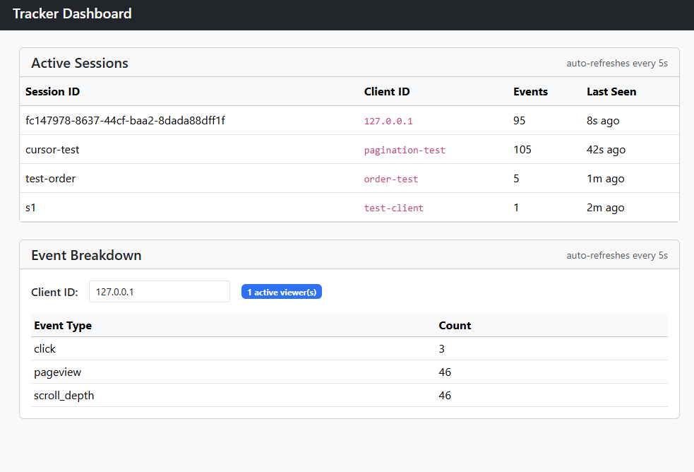

# Real-Time Event Tracking Platform

A lightweight embeddable event tracking system. Paste a small script on any website to start collecting user activity in real time. Monitor sessions and events through a live dashboard.

---

## Prerequisites

- [Docker](https://www.docker.com/) and Docker Compose

---

## Quick Start

```bash
git clone <repo-url>
cd overwoolf_task
docker compose up --build
```

The backend starts on `http://localhost:8080`. Storage is initialized automatically on first run — `schema.sql` is embedded in the binary and applied at startup. A demo client (`demo-client`) is seeded and ready to use.

To verify everything is running:

```bash
curl http://localhost:8080/config/demo-client
```

Expected response:
```json
{
  "status": "success",
  "data": {
    "clientId": "demo-client",
    "flushInterval": 5000,
    "trackedEvents": ["pageview", "click"]
  }
}
```

---

## Storage Initialization

No manual step required. On startup the backend:

1. Creates the `data/` directory if it does not exist
2. Opens (or creates) the SQLite database at `data/tracker.db`
3. Runs `schema.sql` to create tables and indexes (`IF NOT EXISTS` — safe to run repeatedly)
4. Seeds the `demo-client` record

The `data/` directory is mounted as a Docker volume — data persists across container restarts.

To reset storage completely:

```bash
docker compose down
rm -rf data/
docker compose up
```

---

## Running the Backend

```bash
docker compose up
```

To rebuild after code changes:

```bash
docker compose up --build
```

The backend serves:
- API endpoints on `http://localhost:8080`
- The widget at `http://localhost:8080/widget.js`
- The dashboard at `http://localhost:8080/dashboard`

---

## Monitoring Dashboard

Open in any browser after the backend is running:

```
http://localhost:8080/dashboard
```

The dashboard has three sections:

**Session List** — all sessions active in the last 5 minutes. Shows session ID, event count, and time of last activity. Refreshes automatically every 5 seconds.

**Session Detail** — click any session row to see its full chronological event history: event type, timestamp, and metadata for each event.

**Event Breakdown** — total event counts by type for any client ID over the last 5 minutes. Change the client ID input to switch clients.



---

## Embedding the Widget

There are two ways to add the widget — pick based on your goal.

### Option A — Permanent (you own the site)

Edit the site's HTML source and paste this into `<head>`. It will track every visitor from that point on. The client ID is automatically derived from your domain:

```html
<script>
  window._tracker = window._tracker || [];
  (function() {
    var s = document.createElement('script');
    s.src = 'http://localhost:8080/widget.js'; // replace with your backend URL
    s.async = true;
    document.head.appendChild(s);
  })();
</script>
```

The widget automatically uses `location.hostname` as the client ID. To override with a custom ID, set it before the snippet:

```html
<script>
  window._trackerClientId = 'acme-corp';   // optional: custom client ID
  window._tracker = window._tracker || [];
  (function() {
    var s = document.createElement('script');
    s.src = 'http://localhost:8080/widget.js';
    s.async = true;
    document.head.appendChild(s);
  })();
</script>
```

### Option B — Temporary test (any site, no access needed)

Open F12 → Console on any tab, paste this, and hit Enter. The badge appears immediately. This is session-only — it's gone on page refresh and leaves no permanent change.

```js
window._tracker = window._tracker || [];
var s = document.createElement('script');
s.src = 'http://localhost:8080/widget.js';
s.async = true;
document.head.appendChild(s);
```

Once the widget loads it will:
- Fire a `pageview` event automatically
- Track clicks on any element with a `data-track` attribute
- Show a live viewer badge in the bottom-right corner
- Batch and send events every 5 seconds (configurable per client)

### Tracking clicks

Add `data-track` to any element you want to track:

```html
<button data-track="signup-button">Sign Up</button>
<a href="/pricing" data-track="nav-pricing">Pricing</a>
```

### Firing custom events

Call `push` at any time after the snippet runs:

```js
window._tracker.push(['track', <your-event-name>, <your-data>]);
```

Calls made before the widget finishes loading are buffered automatically and replayed once ready — no timing concerns.

### Removing the widget

```js
window._tracker.destroy()
```

Removes the badge, cancels all timers, and detaches all event listeners. No trace remains on the page.

---

## Testing Without a Website

Open `test-site.html` directly in a browser (with the backend running):

```
open test-site.html         # macOS
start test-site.html        # Windows
xdg-open test-site.html     # Linux
```

Or via the F12 console on any open tab, paste the snippet above and hit Enter.

---

## API Reference

| Method | Path | Description |
|--------|------|-------------|
| GET | `/config/:clientId` | Client initialization config |
| GET | `/widget.js` | Widget bundle |
| POST | `/events` | Ingest a batch of events |
| GET | `/sessions` | Active sessions (last 5 min), paginated |
| GET | `/sessions/:sessionId` | Event history for a session, paginated |
| GET | `/stats/:clientId` | Event counts by type (last 5 min) |
| GET | `/dashboard` | Monitoring dashboard |

All responses use the envelope `{ "status": "success"|"error", "data": ... }`.
Full shapes and examples are in [`docs/HLD.md`](docs/HLD.md).

---

## Pagination

`GET /sessions` and `GET /sessions/:sessionId` return pages of 100 items. Both follow the same cursor pattern.

**Response shape:**
```json
{
  "status": "success",
  "data": {
    "total": 1432,
    "items": [ "...up to 100 items..." ],
    "nextCursor": "2026-05-19T16:52:20Z"
  }
}
```

`total` is the full dataset size regardless of page. `nextCursor` is `null` on the last page.

**Fetching the next page:**

```
GET /sessions?before=<nextCursor>
GET /sessions/:sessionId?before=<nextCursor>
```

Pass `nextCursor` from the previous response as the `before` query parameter. Repeat until `nextCursor` is `null`.

**Ordering:**
- `/sessions` — most recently active first (`last_seen DESC`)
- `/sessions/:sessionId` — newest events first (`timestamp DESC`)

---

## Ingest Write Strategy

Each `POST /events` request carries a batch of events and is written in a **single SQLite transaction** — all events commit together or none do. This is an all-or-nothing guarantee: a crash mid-write leaves zero partial batches in the database.

Why a single transaction per batch (not one transaction per event):

- **Atomicity** — the widget sends one coherent flush from a single session. Partial writes would silently drop events with no way to detect or recover them.
- **Throughput** — SQLite serializes writers, but a batch of 10 events in one commit costs the same as a single event. One transaction per flush interval keeps write transactions/second proportional to active sessions, not to raw event volume.
- **No queue needed at current scale** — at ~100 concurrent sessions flushing every 5 seconds that is ~20 write transactions/second, well within SQLite WAL's ~100–200 TPS ceiling. A write queue would add goroutine complexity and in-memory loss risk with no benefit at this load.

WAL (Write-Ahead Logging) mode is enabled at startup so concurrent reads are never blocked by an in-progress write.

---

## Scalability

The relevant unit for storage throughput is **write transactions per second (TPS)**, not raw events per second. The widget batches events and sends one `POST /events` per flush interval — each POST is one transaction regardless of how many events it contains.

### Concurrency model

Each `POST /events` is handled in its own goroutine. All goroutines share a **single SQLite connection** (`SetMaxOpenConns(1)`), so writes are serialized through the connection pool — no "database is locked" errors, no OS threads per request. Goroutines waiting for the connection are ~2 KB each and impose negligible overhead.

### Capacity math

Example: 10 clients × 100 concurrent users = **1,000 concurrent sessions**, flush interval 5 s.

| User activity | Active sessions | Write TPS | Status |
|---|---|---|---|
| 8–10% (typical content site) | ~80–100 | ~16–20 | Safe |
| 50% (interactive site) | ~500 | ~100 | At ceiling |
| 100% (all users clicking) | 1,000 | ~200 | Exceeds SQLite WAL |

SQLite WAL serializes writers. The practical ceiling is **~100–150 sustained write TPS** before latency climbs. There is no write queue — adding one would only delay the same bottleneck without improving throughput.

### Migration triggers

**Move to Postgres when:**
- Sustained write TPS approaches ~100–150
- Multiple backend instances are needed (SQLite is a single file, not shareable)
- Events table grows past ~10 GB

**Add Kafka in front of Postgres when:**
- Write volume exceeds ~50,000–100,000 events/second
- Multiple independent consumers are needed (analytics, alerting, ML)
- Event replay is required

The API contract and `schema.sql` structure do not change at either step — only the storage layer beneath them.

---

